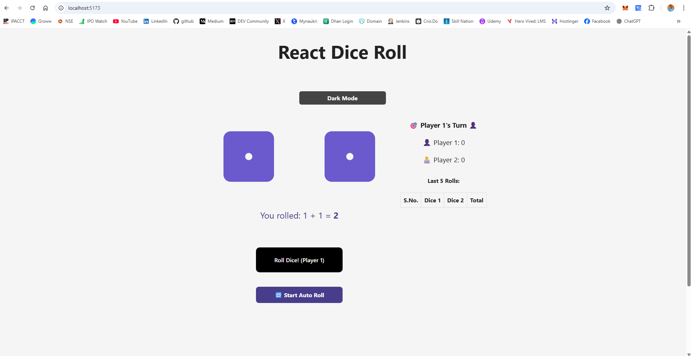

# 🎲 React Dice Roll Game

A fun, interactive dice rolling game built with **React**, featuring:

- 🎲 Two-player mode
- 🎵 Dice rolling sound
- 🥳 Confetti win animation
- 🕹 Auto-roll mode
- 🌗 Light/Dark mode toggle
- 📜 Last 5 rolls history
- 🧠 React performance optimizations using `useCallback` and `useMemo`

---

## 🌐 Live Demo

👉 [Click to Play the Dice Game](https://react-dice-roll-app.vercel.app/)

---

## 📸 Preview

 

---

## 🚀 Features

- 🎯 Turn-based game between two players
- 🧠 Intelligent state handling using React Hooks
- 🎉 Confetti celebration when a player wins (score ≥ 100)
- 🎵 Dice roll sound on each roll
- 🔁 Auto-roll toggle
- 📓 Scoreboard and last 5 roll history
- 🌗 Dark and Light mode support

---

## 🛠 Tech Stack

- React 18+
- Font Awesome (for dice icons)
- canvas-confetti
- HTML5 Audio
- CSS Modules

---

## 📁 Folder Structure

```bash
react-dice-roll/
├── public/
│   └── dice-rolling.mp3
├── src/
│   ├── Components/
│   │   ├── RollDice/
│   │   │   ├── RollDice.jsx
│   │   │   └── RollDice.css
│   │   └── Die/
│   │       ├── Die.jsx
│   │       └── Die.css
│   ├── App.jsx
│   └── App.css
├── package.json
└── README.md
```

---

## 🔧 Installation & Setup
### 1. Clone the repo
```bash

git clone https://github.com/surendergupta/react-dice-roll-app.git
cd react-dice-roll-app

```

### 2. Install dependencies
```bash
npm install
```

### 3. Run the development server
```bash
npm run dev
```

### 4. Build for production
```bash
npm run build
```

---

## 🧪 Testing
This version is interactive and visual. You can test:
- ✅ Roll button click and animation
- ✅ Auto-roll toggle
- ✅ Win detection and confetti
- ✅ Player turn switching
- ✅ Dark/Light theme toggling

---

## 📦 Dependencies
```bash
"@fortawesome/fontawesome-svg-core": "^7.0.0",
"@fortawesome/free-solid-svg-icons": "^7.0.0",
"@fortawesome/react-fontawesome": "^0.2.3",
"canvas-confetti": "^1.9.3",
"react": "^18.3.1",
"react-dom": "^18.3.1"

```

---

## 📃 License
This project is licensed under the MIT License — feel free to use and modify!

---

## 💡 Future Enhancements
- 🧮 Custom score limit
- 🗂 Leaderboard using localStorage
- 📱 Mobile responsiveness
- 🧠 AI auto player
- 🌍 Multiplayer via WebSocket (Socket.io)

---

## 🙌 Acknowledgements
- **Dice icons**: [Font Awesome](https://fontawesome.com/)
- **Sound effects** from [pixabay.com](https://pixabay.com/)
- **Confetti**: [canvas-confetti](https://github.com/catdad/canvas-confetti)

---

## ✨ Author
Made with ❤️ by Surender Gupta

- GitHub: [surendergupta](https://github.com/surendergupta)
- LinkedIn: [surendergupta](https://www.linkedin.com/in/surender-gupta]